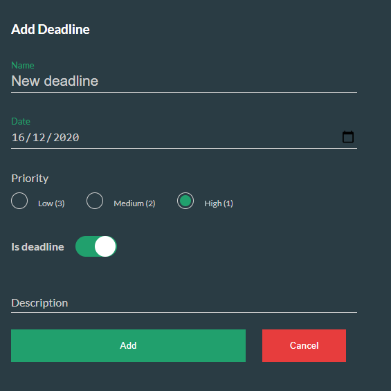
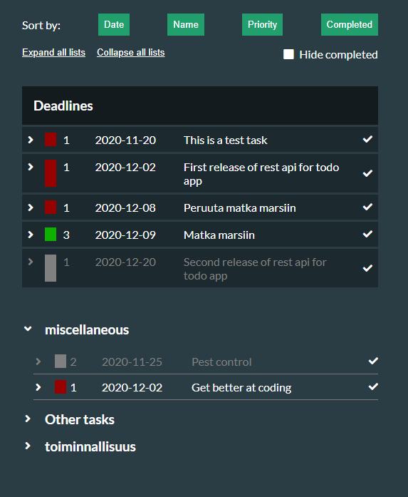
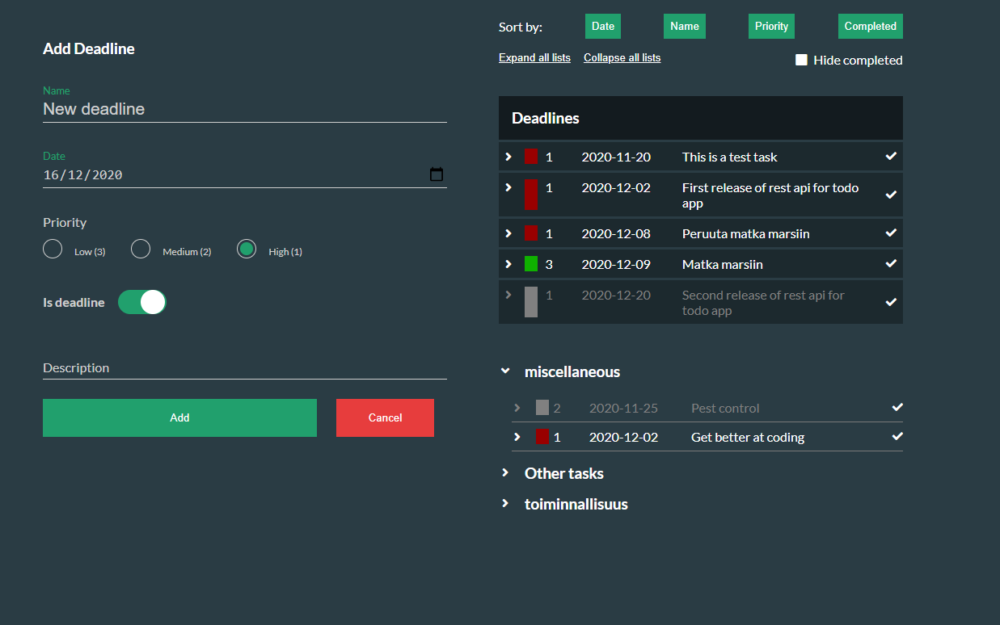

### Find the app running here:

https://tamk-4a00ez62-3001-group11.herokuapp.com/

### Group 11
Aleksi Muikku

Juuso Melentjeff

# Deadline App

Deadline App was created with React framework as a project for TAMK software production orientation Frontend and Backend courses. Goal was to create a web based to-do application that connects to a RESTful API so to-dos could be saved to a database. Project was a team effort between two students. Our goal was to make a to-do application for students with a focus on deadlines.

## Features

Student can add deadlines to the deadline list and at a quick glance see upcoming deadlines. User can also add custom lists to use the application like a traditional to-do application. As the focus is on deadlines, deadline list is always visible. Form also has a deadline toggle. If toggle is on to-dos go to deadline list. If user toggles it off a new input field pops up so user can create a custom list.

Main features:
- Add deadlines to a default visible deadline list
- Add to-dos
- Create custom lists
- Edit and delete to-dos
- Mark to-dos done
- Sort to-dos by date, priority, name and state of completion
- Collapse lists and hide completed to-dos
- See how many days left until deadline

## Screenshots

The Form

The List

The App

